# GymFlow

Sistema de gestión para gimnasios. Permite administrar clientes, entrenadores y rutinas desde un único panel, con acceso diferenciado por rol y una experiencia optimizada para móvil.

Construido como PWA (Progressive Web App) — se puede instalar en el teléfono y funciona con apariencia nativa.

---

## Capturas de pantalla

### Panel Administrador — Dashboard
> Estadísticas en tiempo real: clientes activos, vencidos, próximos a vencer y métodos de pago del mes.

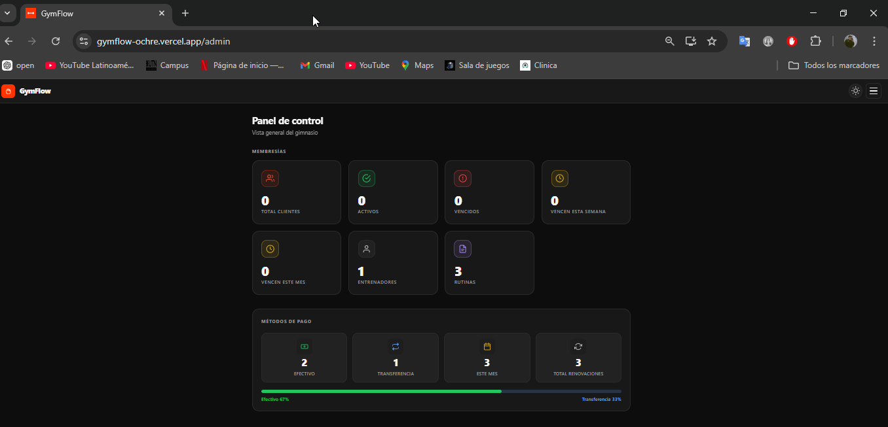

---

### Panel Administrador — Lista de clientes
> Vista de todos los clientes con estado de membresía, fecha de vencimiento, datos personales y acciones rápidas (renovar, reset PIN, historial).

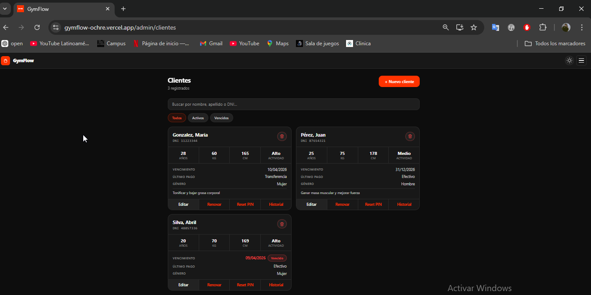

---

### Panel Administrador — Lista de entrenadores
> Gestión de entrenadores: ver, editar y eliminar desde una misma pantalla.

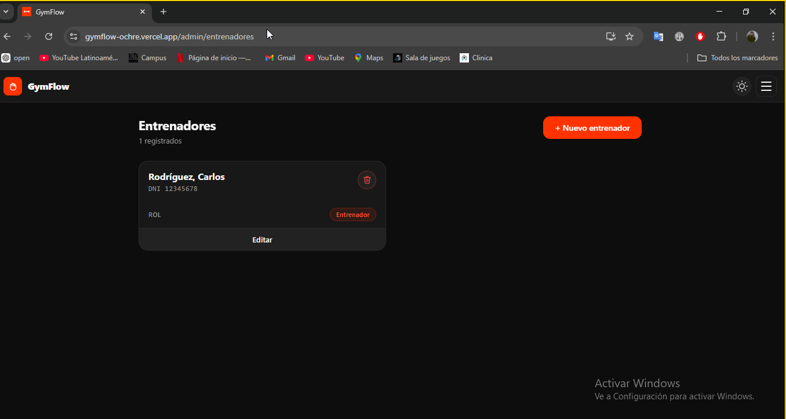

---

### Panel Administrador — Crear nuevo cliente (flujo completo)
> Formulario de alta de cliente: datos personales, PIN de acceso, fecha de vencimiento y método de pago. La primera renovación se registra automáticamente.

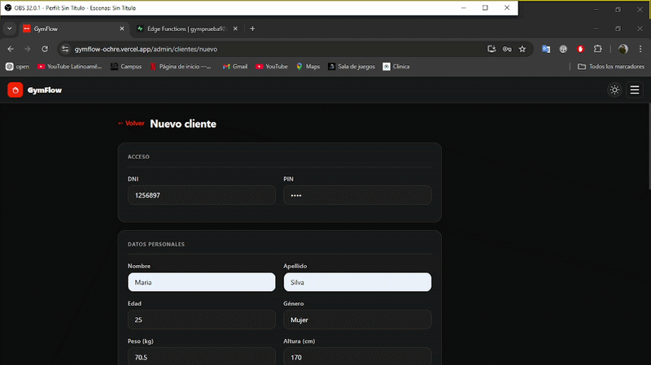

---

### Panel Entrenador — Dashboard
> Resumen del entrenador: cantidad de clientes asignados, rutinas creadas y ejercicios disponibles.

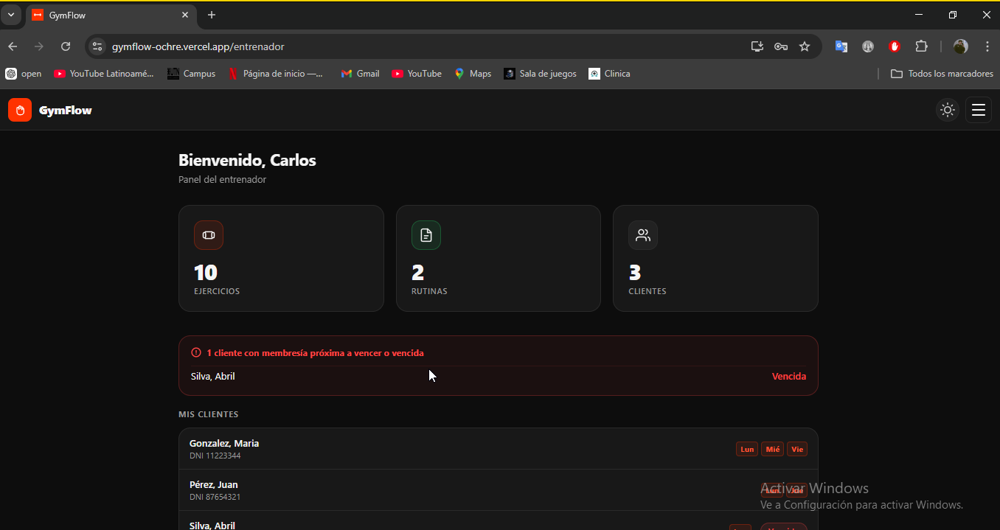

---

### Panel Entrenador — Lista de ejercicios
> Biblioteca de ejercicios con GIF demostrativo, músculo principal, nivel de dificultad y categoría. Se pueden activar, desactivar o eliminar.

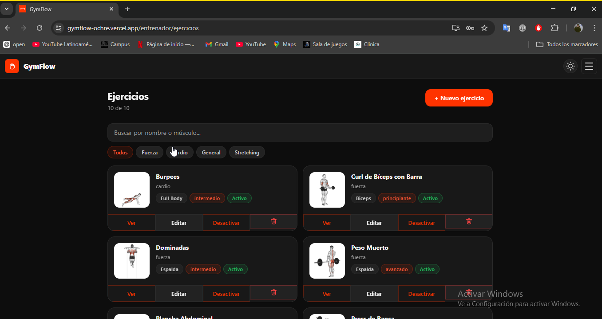

---

### Panel Entrenador — Lista de rutinas
> Rutinas creadas por el entrenador con cantidad de ejercicios, nivel de dificultad y objetivo. Se pueden asignar a clientes por día de la semana.

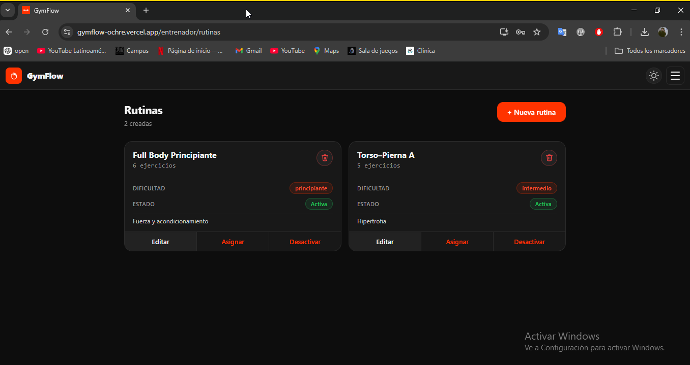

---

### Panel Administrador — Crear nuevo entrenador
> Alta de entrenador con datos personales y PIN de acceso.

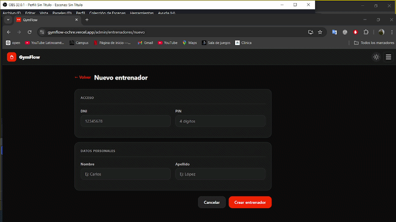

---

### Panel Entrenador — Crear ejercicio con GIF
> Creación de ejercicio: nombre, músculo, nivel, categoría y carga del GIF demostrativo.

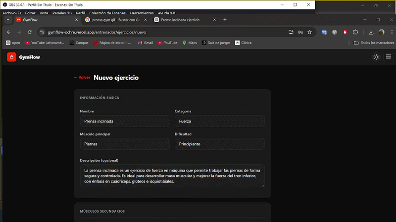

---

### Panel Entrenador — Crear rutina
> Armado de rutina con ejercicios, orden, series, repeticiones, descanso e intensidad.

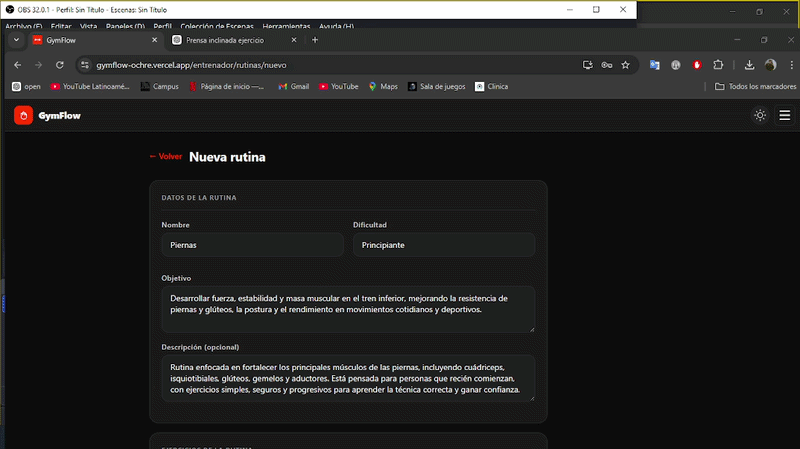

---

### Panel Entrenador — Asignar rutina a cliente
> Asignación de una rutina a uno o varios clientes con día de la semana.

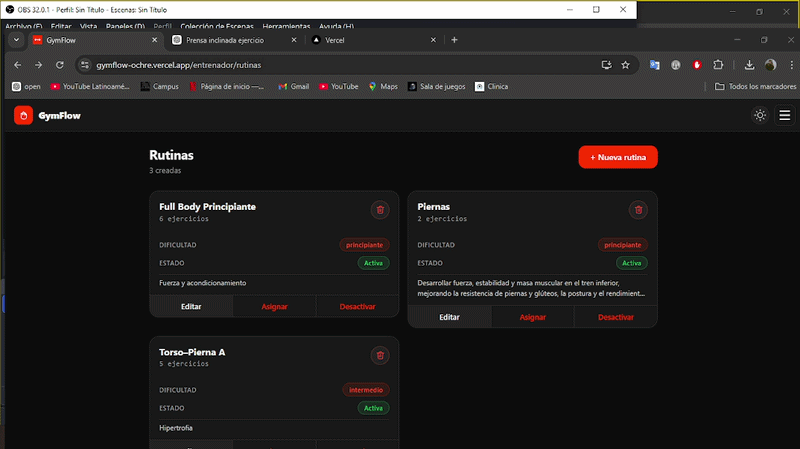

---

### Panel Entrenador — Lista de clientes
> Vista de todos los clientes del gimnasio con badge de rutina asignada y filtros.

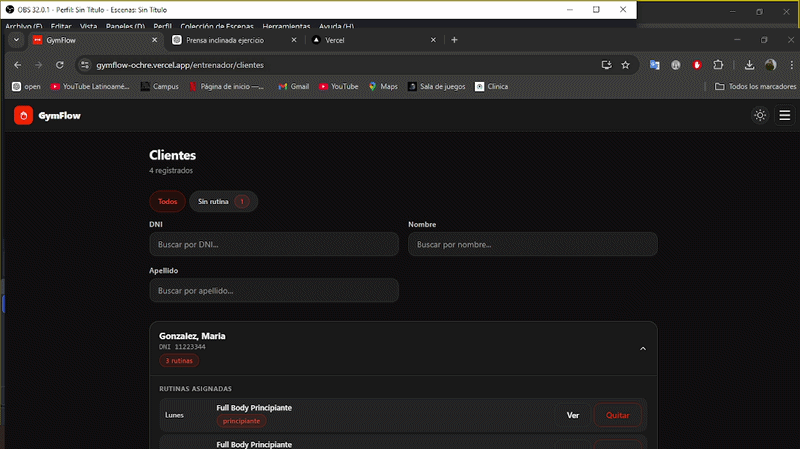

---

### Panel Cliente — Dashboard y rutina del día
> Vista del cliente: saludo, días de entrenamiento asignados, rutina del día con ejercicios, GIF animado y controles de completado.

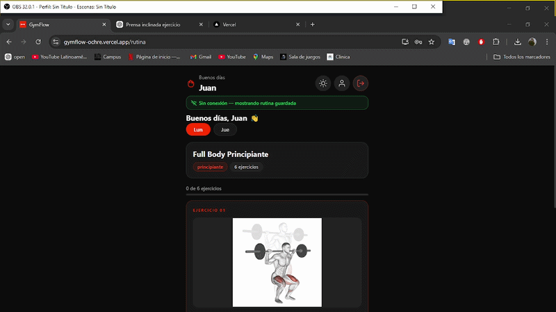

---

## Roles

### Administrador
- Dashboard con estadísticas de membresías (activos, vencidos, por vencer)
- Gestión completa de clientes: alta, edición, renovación de membresía, reset de PIN, historial de pagos
- Gestión de entrenadores
- Métodos de pago (efectivo / transferencia) con estadísticas

### Entrenador
- Dashboard con resumen de clientes y rutinas
- Gestión de ejercicios con GIF demostrativo
- Creación y asignación de rutinas por día de la semana
- Vista de rutina por cliente con posibilidad de modificar series, repeticiones e intensidad individualmente
- Notas por cliente

### Cliente
- Rutina del día con ejercicios, GIF animado, series y repeticiones
- Registro de pesos por ejercicio con historial
- Perfil con estadísticas de actividad (sesiones, días como socio)
- Cambio de PIN desde el perfil

---

## Tecnologías

- **Frontend**: React 19 + Vite + React Router
- **Backend / Base de datos**: Supabase (PostgreSQL + Auth + Storage + Edge Functions)
- **PWA**: vite-plugin-pwa (instalable, íconos, manifest)
- **Deploy**: Vercel

---

## Variables de entorno

Crear un archivo `.env` en la raíz del proyecto:

```env
VITE_SUPABASE_URL=https://tu-proyecto.supabase.co
VITE_SUPABASE_ANON_KEY=tu-anon-key
```

---

## Edge Functions

El proyecto usa tres Edge Functions de Supabase. Deployarlas con:

```bash
npx supabase functions deploy crear-usuario
npx supabase functions deploy actualizar-pin
npx supabase functions deploy eliminar-usuario
```

Cada función requiere que **"Verify JWT"** esté desactivado en el dashboard de Supabase (la verificación se hace dentro del código).

---

## Base de datos — tablas principales

| Tabla | Descripción |
|-------|-------------|
| `users` | Usuarios de auth con rol (`admin`, `entrenador`, `cliente`) |
| `clientes` | Perfil completo del cliente, membresía y estado |
| `entrenadores` | Perfil del entrenador |
| `ejercicios` | Ejercicios con GIF, músculos, instrucciones |
| `rutinas` | Plantillas de rutina creadas por entrenadores |
| `rutinas_ejercicios` | Ejercicios dentro de una rutina con series/reps |
| `rutinas_clientes` | Asignación de rutina a cliente por día de semana |
| `rutinas_clientes_ejercicios` | Modificaciones individuales por cliente |
| `renovaciones` | Historial de pagos y renovaciones de membresía |
| `sesiones_cliente` | Registro de sesiones de entrenamiento completadas |

---

## Deploy en Vercel

1. Conectar el repositorio en [vercel.com](https://vercel.com)
2. Agregar las variables de entorno (`VITE_SUPABASE_URL`, `VITE_SUPABASE_ANON_KEY`)
3. El archivo `vercel.json` ya está configurado para SPA routing

---

## Personalización de marca

Para adaptar la app a un gimnasio específico:

- **Nombre y logo**: `src/features/auth/LoginPage.jsx` (SVG del logo y texto "GymFlow")
- **Colores principales**: `src/styles/variables.css` (variables CSS `--acento`, `--acento-glow`, etc.)
- **Nombre en el manifest PWA**: `vite.config.js` → `manifest.name` y `manifest.short_name`
- **Íconos PWA**: reemplazar archivos en `public/` y regenerar con `npm run generate-icons`
- **Dominio de email interno**: `supabase/functions/*/index.ts` → constante `EMAIL_DOMAIN`

---

## Desarrollo local

```bash
npm install
npm run dev
```
